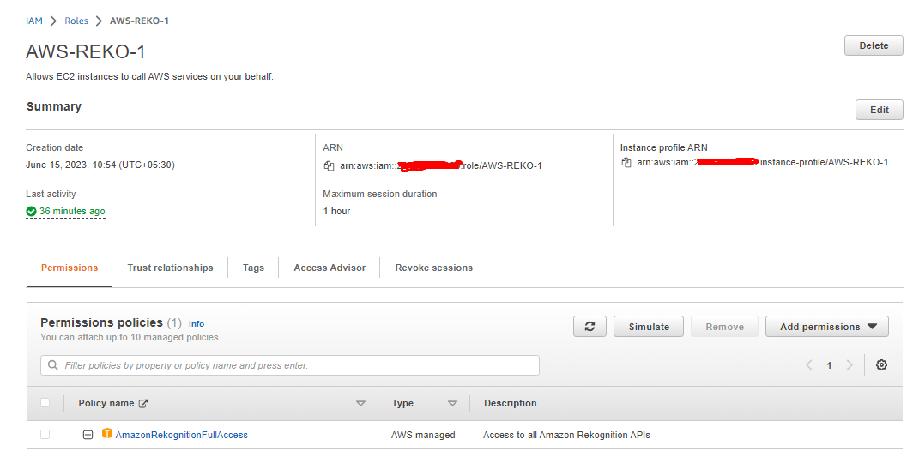
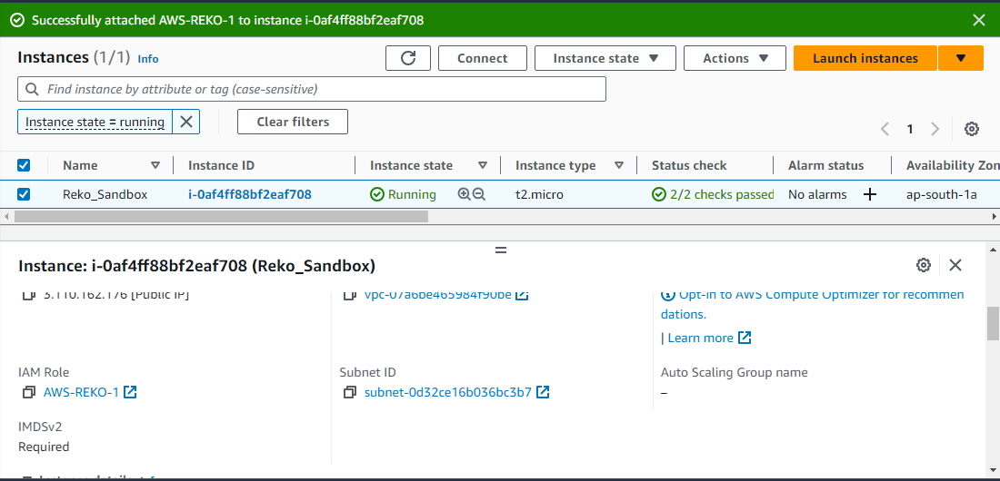
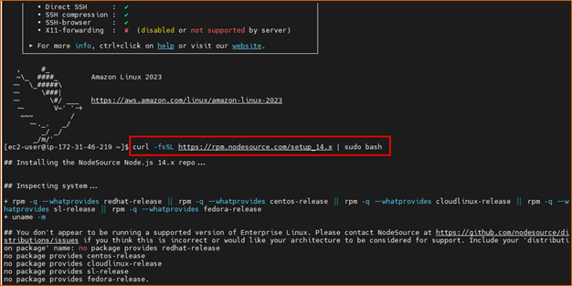
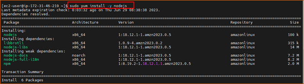
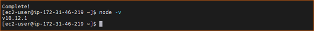
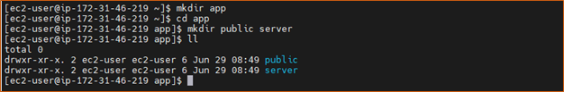

# aws-reko
## Cerate a IAM role with following policies.

## Attach role to EC2 instance.

## Login with SSH EC2 instance and install `nodejs`
### Add nodejs package to yum repo. 

## Install nodejs

## Check node version.

## Run the following commands

## clone 