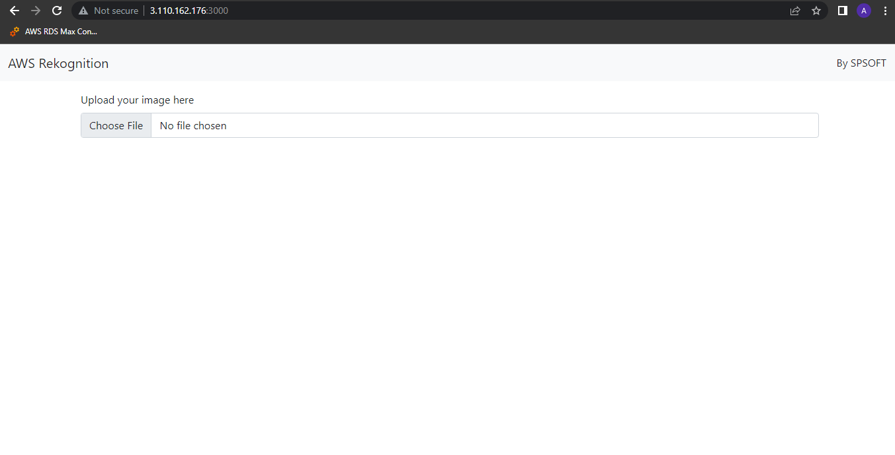

# AWS-Rekognition
## Cerate a IAM role with following policies.

## Create a EC2 instance and attach role to EC2 instance.

## Login with SSH EC2 instance and install `nodejs`
### Add nodejs package to yum repo. 

## Install nodejs

## Check node version.

## Run the following commands

## Clone the code and execute folloeing commands.

## Install npm packages using `npm install` command.

## Start the server using following command.

## Navigate to the browser and type the following:-
`http://<ServerPublicIP>:3000`

## Upload a image and check the result.
### with out face

### with face
